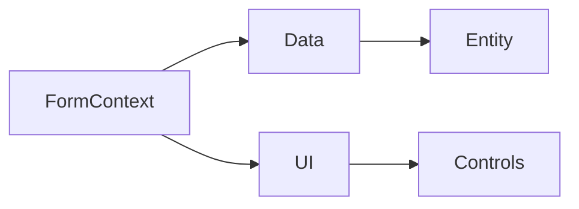

# Dataverse SDK Object Models

A collection of open-source **Mermaid diagrams** that provide a visual reference for the Microsoft Dataverse SDK.

The goal of this repository is to make the Dataverse development APIs easier to understand by visualizing the main objects, services, relationships, and commonly used interfaces.

The repository currently covers:

- **Dataverse Client Object Model**
- **Dataverse Backend Services**

These diagrams are intended for Dynamics 365 and Power Platform developers, consultants, architects, trainers, and anyone learning Dataverse development.

---

## Client Object Model

The **Client Object Model** diagram provides a visual overview of the client-side APIs available when developing Model-driven Apps.

It covers the main objects and relationships developers interact with when working with the Dataverse Client API.

### View the interactive diagram

[Open Client Object Model in Mermaid](https://mermaid.ai/d/e4513708-5cd2-4485-a205-57fbddf0d657)

---

## Backend Services

The **Backend Services** diagram provides a visual overview of the main services and objects commonly used when developing server-side Dataverse extensions.

This includes components typically used in:

- Plug-ins
- Custom APIs
- Custom workflow activities
- Dataverse SDK integrations
- Server-side business logic

### View the interactive diagram

[Open Backend Services in Mermaid](https://mermaid.ai/d/2662dcd8-3ae4-439b-9269-3d8cc71cdaa9)

---

# How to Use the Diagrams

You can use these diagrams as:

- A quick Dataverse SDK reference
- A learning resource
- Training material
- Architecture documentation
- Development documentation
- A starting point for your own customized diagrams

You can either use the diagrams directly from the links above or use the Mermaid source files available in this repository.

---

# How to Modify the Diagrams

The diagrams are written using [Mermaid](https://mermaid.js.org/), which means they can be modified without using a dedicated diagramming application.

## Option 1 – Fork the Repository

The easiest way to create your own version is to fork this repository.

1. Click **Fork** at the top of this GitHub repository.
2. Open the corresponding Mermaid source file.
3. Modify the Mermaid definition.
4. Preview your changes using a Mermaid-compatible editor.
5. Commit the changes to your fork.

This allows you to maintain your own customized version of the Dataverse object models.

---

## Option 2 – Clone the Repository

You can also work with the repository locally.

```bash
git clone https://github.com/dr-mahmoud-samir/Dataverse-SDK-object-models.git
```

Then open the repository:

```bash
cd Dataverse-SDK-object-models
```

Open the Mermaid source files using your preferred editor.

For example, you can use:

- Visual Studio Code with a Mermaid preview extension
- Mermaid-compatible Markdown editors
- Mermaid online editors

Modify the Mermaid source and preview the result before committing your changes.

---

# Editing Mermaid

Mermaid diagrams are defined using a text-based syntax.

A simple example:



Because the diagram is represented as text, changes can easily be reviewed and tracked using Git.

For example, you can:

- Add missing Dataverse objects
- Add methods or properties
- Correct relationships
- Reorganize diagram sections
- Add additional SDK services
- Improve descriptions
- Create diagrams for additional Dataverse development areas

---

# Contributing

Contributions are welcome.

If you find:

- A missing SDK object
- An incorrect relationship
- A deprecated API
- A new Dataverse capability
- A better way to organize the diagram

you are welcome to contribute.

### Contribution workflow

1. Fork the repository.
2. Create a new branch.

```bash
git checkout -b feature/update-client-object-model
```

3. Update the relevant Mermaid diagram.
4. Preview and validate the diagram.
5. Commit your changes.

```bash
git commit -m "Update Dataverse Client Object Model"
```

6. Push your branch.

```bash
git push origin feature/update-client-object-model
```

7. Create a **Pull Request** against this repository.

Please include a short explanation of what was changed and why.

---

# Keeping the Diagrams Accurate

Dataverse and the Power Platform evolve continuously.

If Microsoft introduces new APIs or deprecates existing ones, the diagrams may need to be updated.

Whenever possible, changes should be validated against the official Microsoft Dataverse documentation.

Microsoft Learn:

https://learn.microsoft.com/power-apps/developer/data-platform/

Client API Reference:

https://learn.microsoft.com/power-apps/developer/model-driven-apps/clientapi/reference

---

# License

This project is available under the **MIT License**.

You are free to:

- Use the diagrams
- Modify them
- Share them
- Include them in training material
- Use them in commercial projects
- Create your own versions

Please keep the original copyright and license notice when redistributing the source.

See the [LICENSE](LICENSE) file for details.

---

# Disclaimer

This is a community-driven open-source project and is **not an official Microsoft product or Microsoft documentation**.

The diagrams are intended as visual learning and development references. Always refer to the official Microsoft documentation when validating APIs for production implementations.

---

# Feedback

Feedback, corrections, and contributions are very welcome.

If you find something that should be added or changed, please:

- Open a GitHub Issue
- Submit a Pull Request
- Suggest an improvement

⭐ If you find the repository useful, consider giving it a **Star** to help other Dataverse developers discover it.
